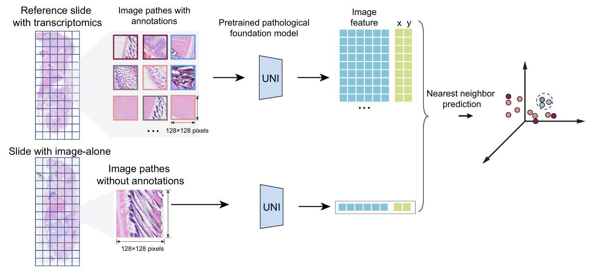

# LABEL: Spatially Aware Histology-Based Classification

LABEL is a pipeline that integrates histology feature extraction with a spatially aware hierarchical classifier to predict organ, subregion, and broad cell type identities from H&E images.

## 1. Preprocessing (`01_preprocess/`)

- **Stain normalization**: Applied the Vahadane algorithm to harmonize H&E colors across all samples, using one representative section as the reference.
- **Patch extraction**: Tissue slides were segmented into patches centered on spatial transcriptomic capture spots.
- **Input formatting for UNI**:
  - Patches resized and center-cropped to **224 × 224 pixels**
  - Converted to tensors
  - Normalized according to UNI model requirements
- **Feature extraction**: Pretrained **UNI pathology foundation model** used to generate a **1,536-d embedding** per patch.
- **Patch size evaluation**: Multiple sizes (32–512 px) were tested; **128 × 128 pixels** was chosen for best performance.

------

## 2. Prediction (`02_prediction/`)

- **Classifier**: Spatially aware **k-Nearest Neighbor (k=5)**
- **Feature preparation**: UNI features concatenated with spatial coordinates → reduced to **200 dimensions by PCA**
- **Hierarchical classification**: Independent KNN classifiers fitted at each level:
  1. Organ
  2. Subregion
  3. Broad cell type
- **Training schemes**:
  - 80/20 random split across sections
  - Leave-one-section-out cross-validation

------

## 3. Evaluation (`03_evaluation/`)

- **Metrics**: Normalized confusion matrices, restricted to classes present in both control replicates.
- **Cell type filter**: Broad cell types with ≥1% abundance retained.
- **Interpretation**: Each matrix entry (i,j) shows the proportion of true class *i* predicted as class *j*. Diagonal values represent classification accuracy.